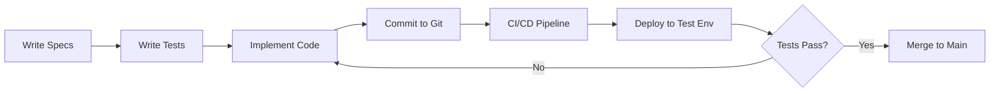

# Project Chimera: Tooling Strategy

**Version:** 1.0  
**Last Updated:** February 5, 2026  
**Purpose:** Define the MCP servers and development tools used to BUILD Project Chimera (not the runtime tools used BY the agents)

---

## 1. Overview

This document distinguishes between two categories of tools:

**Category A: Developer MCP Servers**
- Tools that help US (human developers + AI assistants) build the system
- Used during development, testing, and deployment
- Examples: Git integration, filesystem access, database admin tools

**Category B: Agent Runtime Skills** (See `skills/README.md`)
- Tools that Chimera agents use during operation
- Examples: Social media posting, image generation, trend analysis

**This document focuses on Category A.**

---

## 2. Development Workflow & Tool Requirements

### 2.1 The Development Lifecycle



Each stage requires specific tools:

| Stage | Required Capabilities | MCP Server Needed |
|-------|----------------------|-------------------|
| Write Specs | Read/write markdown files | `filesystem` |
| Write Tests | Create test files, mock data | `filesystem` |
| Implement Code | Read specs, write Python | `filesystem` |
| Commit to Git | Stage, commit, push | `git` |
| CI/CD Pipeline | Run tests, build Docker | GitHub Actions (not MCP) |
| Database Admin | Inspect schemas, run queries | `postgres` (optional) |

---

## 3. Selected MCP Servers for Development

### 3.1 Core MCP Servers (MUST HAVE)

#### MCP Server: Filesystem
**Purpose:** Read, write, and navigate project files

**Provider:** `@modelcontextprotocol/server-filesystem`

**Installation:**
```bash
npm install -g @modelcontextprotocol/server-filesystem
```

**Configuration (for Cursor/Claude Desktop):**
```json
{
  "mcpServers": {
    "filesystem": {
      "command": "npx",
      "args": [
        "-y",
        "@modelcontextprotocol/server-filesystem",
        "/path/to/project-chimera"
      ]
    }
  }
}
```

**Capabilities:**
- `read_file` - Read specs, code, configs
- `write_file` - Create new files
- `edit_file` - Modify existing files
- `list_directory` - Navigate project structure
- `search_files` - Find files matching patterns

**Use Cases in Chimera:**
- AI assistant reads `specs/technical.md` before implementing Planner
- AI assistant creates `src/swarm/planner.py`
- AI assistant updates `functional.md` checkboxes after feature completion

---

#### MCP Server: Git
**Purpose:** Version control operations from within AI coding environment

**Provider:** Custom (see implementation in `mcp/dev-servers/git-mcp/`)

**Capabilities:**
- `git_status` - Check working tree status
- `git_diff` - View changes
- `git_add` - Stage files
- `git_commit` - Commit with message
- `git_log` - View commit history
- `git_branch` - List/create branches

**Use Cases in Chimera:**
- AI assistant commits after completing a feature
- AI assistant checks if specs have uncommitted changes
- Human reviews commit history to track AI's progress

**Implementation Note:**
Since there's no official git MCP server, we'll create a lightweight wrapper:

```python
# mcp/dev-servers/git-mcp/server.py
from mcp.server import Server
import subprocess

server = Server("git-mcp")

@server.call_tool()
async def git_status(arguments: dict) -> str:
    """Returns git status output."""
    result = subprocess.run(
        ["git", "status", "--short"],
        capture_output=True,
        text=True,
        cwd=arguments.get("repo_path", ".")
    )
    return result.stdout

@server.call_tool()
async def git_commit(arguments: dict) -> str:
    """Commits staged changes with message."""
    message = arguments["message"]
    result = subprocess.run(
        ["git", "commit", "-m", message],
        capture_output=True,
        text=True
    )
    return result.stdout
```

---

### 3.2 Optional MCP Servers (NICE TO HAVE)

#### MCP Server: PostgreSQL Inspector
**Purpose:** Query database schemas and data during development

**Provider:** Custom or community-built

**Capabilities:**
- `list_tables` - Show all tables
- `describe_table` - View table schema
- `execute_query` - Run SELECT queries (read-only for safety)

**Use Cases:**
- Verify database migrations applied correctly
- Inspect agent task queue data
- Debug data inconsistencies

**Security Note:** This should ONLY connect to development databases, never production.

---

#### MCP Server: Docker
**Purpose:** Manage containers during local development

**Provider:** Custom

**Capabilities:**
- `docker_ps` - List running containers
- `docker_logs` - View container logs
- `docker_compose_up` - Start services
- `docker_compose_down` - Stop services

**Use Cases:**
- AI assistant starts Redis/Weaviate/Postgres before running tests
- AI assistant checks orchestrator container logs to debug errors

---

### 3.3 Tenx MCP Sense (REQUIRED - Already Configured)

**Purpose:** "Black box" flight recorder for AI development activity

**Provider:** Tenx MCP

**Capabilities:**
- Records all tool calls made by AI assistant
- Captures reasoning traces
- Logs decision points
- Provides telemetry for assessment

**Configuration:**
```json
{
  "mcpServers": {
    "tenx-sense": {
      "command": "npx",
      "args": ["-y", "@tenxmcp/sense"]
    }
  }
}
```

**Use Cases:**
- Track AI assistant's thought process during development
- Verify that AI followed spec-driven workflow
- Provide evidence of traceability for assessment

**Assessment Requirement:** Must remain connected throughout Task 2 and Task 3.

---

## 4. Tool Usage Policies

### 4.1 When to Use MCP vs. Direct Commands

**Use MCP when:**
- Working within AI coding environment (Cursor, Claude Desktop)
- Need to maintain context across operations
- Want actions logged in Tenx Sense

**Use direct terminal commands when:**
- Performing one-off administrative tasks
- Running CI/CD pipelines
- Human developer is working independently

**Example:**
```bash
# ✅ CORRECT: AI assistant using filesystem MCP
AI: [Uses filesystem.write_file to create src/swarm/planner.py]

# ✅ ALSO CORRECT: Human developer using terminal
Human: $ vim src/swarm/planner.py

# ❌ INEFFICIENT: AI assistant suggesting manual file edits
AI: "Please open src/swarm/planner.py and add line 42..."
   (AI should just use write_file tool directly)
```

### 4.2 Security Boundaries

**Safe for MCP:**
- Read/write project files within repository
- Git operations (status, commit, log)
- Database queries on local dev database

**Forbidden for MCP:**
- Access to files outside project directory
- Database writes to production
- Deployment to production environments
- Access to secrets/credentials (use environment variables instead)

---

## 5. MCP Server Priority for Phase 1

Given time constraints (completing by Friday), we prioritize:

### HIGH Priority (Implement Now):
1. **Filesystem MCP** - Essential for reading specs and writing code
2. **Tenx Sense** - Required for assessment
3. **Git MCP** (basic)** - At minimum: status, commit

### MEDIUM Priority (Implement if Time Permits):
4. **Postgres Inspector** - Useful for debugging but not blocking

### LOW Priority (Defer to Phase 2):
5. **Docker MCP** - Can use terminal commands for now
6. **Advanced Git features** (branches, merges, rebases)

---

## 6. Installation & Setup Guide

### 6.1 Prerequisites

```bash
# Node.js (for MCP servers)
node --version  # Should be v18+

# Python with uv
uv --version

# Git
git --version
```

### 6.2 Install Core MCP Servers

```bash
# 1. Filesystem MCP
npm install -g @modelcontextprotocol/server-filesystem

# 2. Tenx Sense (if not already installed)
npm install -g @tenxmcp/sense
```

### 6.3 Configure in Cursor/Claude Desktop

Create or update `~/.cursor/config.json` (or equivalent):

```json
{
  "mcpServers": {
    "filesystem": {
      "command": "npx",
      "args": [
        "-y",
        "@modelcontextprotocol/server-filesystem",
        "/absolute/path/to/project-chimera"
      ]
    },
    "tenx-sense": {
      "command": "npx",
      "args": ["-y", "@tenxmcp/sense"]
    }
  }
}
```

### 6.4 Verify Connection

In your AI coding environment, test:

**Test Filesystem MCP:**
```
Human: "List all files in the specs/ directory"
AI: [Uses filesystem MCP to list files]
```

**Test Tenx Sense:**
```
Human: "Check if Tenx Sense is recording"
AI: [Confirms connection and shows recent activity log]
```

---

## 7. Custom MCP Server Development (If Needed)

If a required MCP server doesn't exist, we can build one quickly.

### Template Structure:

```
mcp/dev-servers/
└── custom-server-name/
    ├── README.md          # Server documentation
    ├── server.py          # Main server implementation
    ├── requirements.txt   # Python dependencies
    └── tests/
        └── test_server.py # Server tests
```

### Minimal Server Example:

```python
# mcp/dev-servers/git-mcp/server.py
from mcp.server import Server
from mcp.server.stdio import stdio_server
import subprocess
from typing import Any

app = Server("git-mcp")

@app.list_tools()
async def list_tools() -> list[Any]:
    return [
        {
            "name": "git_status",
            "description": "Get git status of repository",
            "inputSchema": {
                "type": "object",
                "properties": {
                    "repo_path": {"type": "string"}
                },
                "required": []
            }
        }
    ]

@app.call_tool()
async def call_tool(name: str, arguments: dict) -> list[Any]:
    if name == "git_status":
        result = subprocess.run(
            ["git", "status", "--short"],
            capture_output=True,
            text=True,
            cwd=arguments.get("repo_path", ".")
        )
        return [{"type": "text", "text": result.stdout}]
    
    return [{"type": "text", "text": f"Unknown tool: {name}"}]

async def main():
    async with stdio_server() as (read_stream, write_stream):
        await app.run(read_stream, write_stream)

if __name__ == "__main__":
    import asyncio
    asyncio.run(main())
```

### Running Custom Server:

```bash
# In Cursor/Claude Desktop config
{
  "git": {
    "command": "python",
    "args": ["/path/to/mcp/dev-servers/git-mcp/server.py"]
  }
}
```

---

## 8. Troubleshooting Common Issues

### Issue: MCP server not connecting

**Symptoms:**
- AI assistant says "I cannot access the filesystem"
- Tenx Sense shows no activity

**Solutions:**
1. Check config file path is correct
2. Verify Node.js is installed (`node --version`)
3. Test MCP server manually:
   ```bash
   npx @modelcontextprotocol/server-filesystem /path/to/project
   ```
4. Restart AI coding environment

### Issue: Git operations failing

**Symptoms:**
- `git_commit` returns error
- "fatal: not a git repository"

**Solutions:**
1. Ensure you're in project root: `cd /path/to/project-chimera`
2. Initialize git if needed: `git init`
3. Configure git identity:
   ```bash
   git config user.name "Your Name"
   git config user.email "your.email@example.com"
   ```

### Issue: Tenx Sense not recording

**Symptoms:**
- No telemetry data in dashboard
- Assessment rubric cannot verify AI activity

**Solutions:**
1. Check Tenx Sense is in MCP config
2. Verify connection in AI environment
3. Contact Tenx support if persisting

---

## 9. Development Workflow Example

### Scenario: AI Assistant Implements Planner Agent

**Step 1: AI reads specs**
```
AI uses filesystem.read_file("specs/functional.md")
AI uses filesystem.read_file("specs/technical.md")
AI identifies FR-SWARM-001 and corresponding schema
```

**Step 2: AI checks existing tests**
```
AI uses filesystem.list_directory("tests/functional/")
AI finds test_planner.py exists (but tests are failing - TDD!)
```

**Step 3: AI implements feature**
```
AI uses filesystem.write_file("src/swarm/planner.py", code_content)
AI uses filesystem.write_file("src/schemas/task.py", schema_content)
```

**Step 4: AI commits work**
```
AI uses git.status() to see modified files
AI uses git.add(["src/swarm/planner.py", "src/schemas/task.py"])
AI uses git.commit("feat(swarm): implement Planner agent - FR-SWARM-001")
```

**Step 5: AI updates specs**
```
AI uses filesystem.edit_file("specs/functional.md")
AI marks checkboxes as complete: [x] Generate task DAG
```

**All of this is logged in Tenx Sense for assessment.**

---

## 10. Success Criteria for Developer Tooling

By the end of Task 2.3 (Sub-Task A), we should have:

- [x] This `research/tooling_strategy.md` document
- [ ] Filesystem MCP configured and tested
- [ ] Tenx Sense connected and recording
- [ ] Git MCP (basic) functional (or manual git workflow documented)
- [ ] AI assistant can read specs, write code, and commit changes

---

## 11.Next Steps
---

**Document Control:**
- **Created:** February 5, 2026
- **Status:** Complete - Developer Tools Strategy
- **Next Document:** `skills/README.md` (Agent Runtime Skills)
- **Owner:** Project Lead
